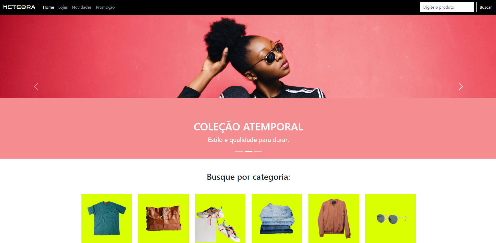

# Projeto Loja Virtual utilizando Bootstrap

| :placard: Vitrine.Dev |     |
| -------------  | --- |
| :sparkles: Nome        | **Projeto Loja Virtual utilizando Bootstrap**
| :label: Tecnologias | HTML, CSS, Bootstrap5
| :rocket: URL         | https://thamyresmya.github.io/Loja-virtual/Loja-virtual

 

  <a href="#-tecnologias">Tecnologias</a>&nbsp;&nbsp;&nbsp;|&nbsp;&nbsp;&nbsp;  
  <a href="#-projeto">Projeto</a>&nbsp;&nbsp;&nbsp;|&nbsp;&nbsp;&nbsp;  
  <a href="#-gif">Gif</a>&nbsp;&nbsp;&nbsp;&nbsp;&nbsp;&nbsp;

 

## 🚀 Tecnologias

Esse projeto foi desenvolvido com as seguintes tecnologias:

- HTML
- CSS
- Bootstrap5

 

## 💻 Projeto

Projeto de uma loja virtual fictícia utilizando ferramenta Bootstrap na versão 5, HTML e CSS. Aplicando responsividade em imagens e componentes, e a aplicar temas de cores do Bootstrap. Implementação de acessibilidade para leitores de tela e posicionamento de elementos utilizando soluções com Grid e Flexbox do Bootstrap.

 

## 📁 Acesso ao projeto

É possível acessar o projeto através do [Link](https://github.com/Thamyresmya/Loja-virtual)

 

## 📸 Gif

</img>

Tela principal  
</img>

 

Me siga nas redes sociais:
- [Linkedin](https://www.linkedin.com/in/thamyrescavalcante/)
- [Instagran](https://www.instagram.com/thamyres__cavalcante/)

 

---

Feito com ♥ by Thamyres Cavalcante.

